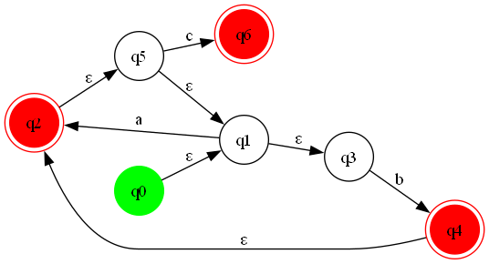

# Regular Expression to NFA Converter

This project implements a Python program to convert a given regular expression into a Non-deterministic Finite Automaton (NFA). The tool supports various regex operators, including `|` (alternation), `*` (Kleene star), `+` (one or more repetitions), and `()` parentheses for grouping.

## Features
- Converts regular expressions into NFA transition diagrams.
- Supports the following regex operators:
  - `|`: Alternation (e.g., `a|b` matches `a` or `b`).
  - `*`: Kleene star (e.g., `a*` matches zero or more `a`'s).
  - `+`: One or more repetitions (e.g., `a+` matches one or more `a`'s).
  - `()`: Parentheses for grouping (e.g., `(a|b)c`).
- Generates a visual representation of the NFA as a transition diagram.

## Algorithm
For building the NFA the program uses the Thompson Construction Algorithm. This algorithm guarantees a simple construction from the regular expression of the resulting NFA, by recursively splitting the regular expression into smaller pieces and combing them in a single automaton containing all of them. Key steps of the algorithm include:

- Base Case: For a single character, create an NFA with two states and a transition labeled with the character.
- Alternation (|): Create a new start state and accept state, with epsilon transitions to the start states of the two sub-NFAs.
- Kleene Star (*): Add epsilon transitions to allow zero or more repetitions of the sub-NFA.
- One or More (+): Similar to Kleene Star, but ensures at least one occurrence of the sub-NFA.
- Grouping: Parentheses are handled by recursively processing the enclosed sub-pattern.

## Requirements
- Python 3.7 or later
- Libraries:
  - `graphviz` (for generating transition diagrams)

## Installation
1. Clone the repository:
   ```bash
   git clone https://github.com/saelthorn/regex-nfa.git
   cd regex-to-nfa
   ```
2. Install the required libraries:
   ```bash
   pip install graphviz
   ```

## Usage
1. Create or modify a Python script to define your regular expression:
   ```python

   regex = "(a|b)+c"
   nfa = RegexNFA(regex)
   _build_nfa()
   visualize(output_file="regex_nfa")
   ```
2. Run the script:
   ```
   python main.py
   ```
3. View the generated `regex_nfa.png` file to see the transition diagram of the NFA.


## Example
### Input
Regular expression: `(a|b)+c`

### Output
Transition Diagram:



### Explanation
1. Start with the initial state `q0`.
2. Handle alternation `(a|b)` using epsilon transitions.
3. Apply the `+` operator to create a loop for `a` and `b`.
4. Add a transition for `c` leading to the accept state.

## File Structure
- `main.py`: Contains the main logic for converting regular expressions to NFAs.
- `README.md`: Documentation for the project.
- `regex_nfa.png`: Transition Diagram from the input in 'main.py'.
- `requirements.txt`: Lists required Python libraries.

## Future Improvements
- Conversion of NFA to DFA.
- Full-Fledged Application


